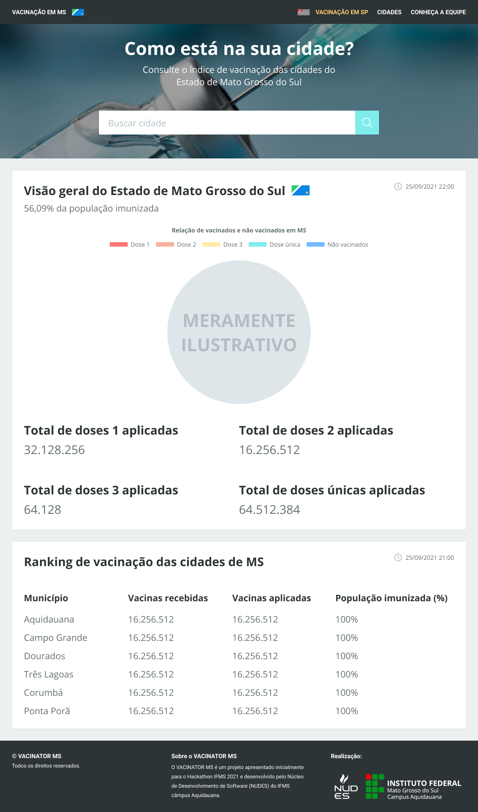
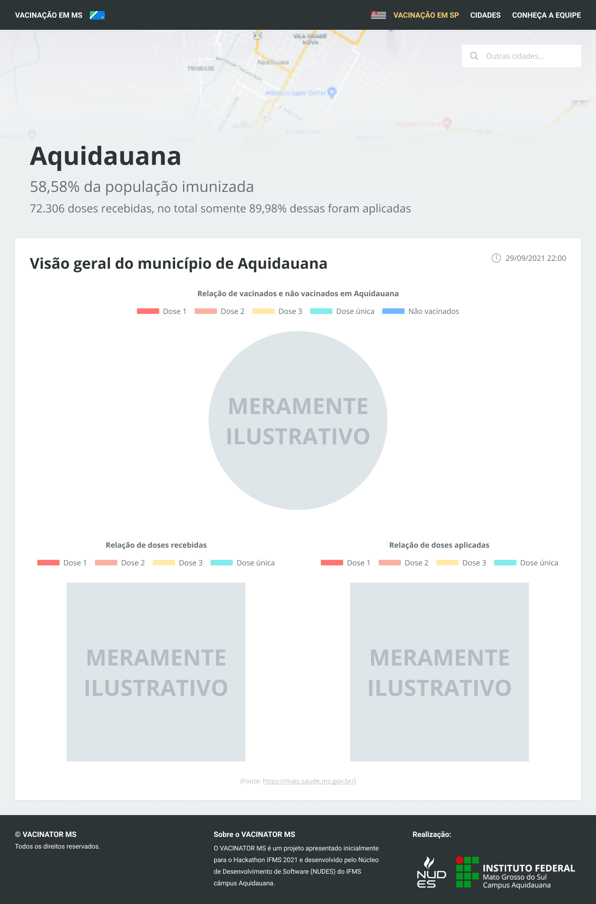
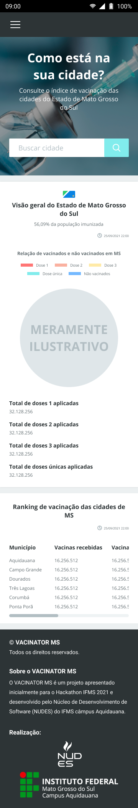
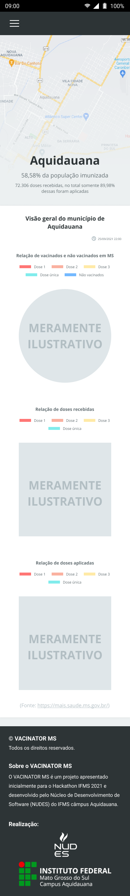

# hackathon-2021

## Sumário

- [hackathon-2021](#hackathon-2021)
  - [Sumário](#sumário)
  - [Motivação](#motivação)
  - [Pilha de tecnologia](#pilha-de-tecnologia)
  - [Galeria](#galeria)
  - [Como rodar](#como-rodar)
    - [Pré-requisitos](#pré-requisitos)
    - [Passo a passo](#passo-a-passo)
  - [Referências bibliográficas](#referências-bibliográficas)

## Motivação

> Assegurar uma vida saudável e promover o bem-estar para todos, em todas as idades.

Pré-batizado de Vacinator MS, este projeto consiste em um _dashboard_ alternativo sobre a cobertura vacinal nos municípios do Estado de Mato Grosso do Sul. Ele foi [apresentado](https://youtu.be/NZXA7R_MM94/) no evento Hackathon 2021 como proposta para colaborar com a terceira meta global, grafada acima, dos Objetivos de Desenvolvimento Sustentável estabelecidos pela Assembleia Geral das Nações Unidas.

A ideia se mostrou viável ao time uma vez que foi proposta no final de setembro de 2021, quando a pandemia não estava sob controle e faltavam apenas seis meses para o carnaval de 2022, o que definitivamente aumentaria (e aumentou[[1]](#referencia-bibliografica-1)) o número de infecções e mortes por COVID-19 devido à falta de distanciamento social e negligência com o uso de máscaras. O projeto foi proposto pelo professor e orientador do time [Sidney Roberto de Sousa](https://github.com/sidneyroberto), baseando-se em um projeto desenvolvido pelo Instituto de Ciência e Tecnologia da Universidade Federal de São Paulo (ICT-UNIFESP) em parceria com o IFMS câmpus Aquidauana, pré-batizado de [Fluxo de Vacinação](https://fluxovacinacaocovid.web.app/). Esse projeto, por sua vez, trata apenas da cobertura vacinal nos municípios do Estado de São Paulo. Infelizmente, ele chegou ao fim do seu ciclo de vida[1](#nota-de-rodape-1) e a API da qual ele consumia os serviços de consulta foi derrubada.

Vale destacar que este projeto se trata de uma alternativa à tecnologia já utilizada pela Secretaria de Estado de Saúde, que consiste em um extenso relatório[2](#nota-de-rodape-2) gerado pela ferramenta de _Business Intelligence_ Qlik Sense. A razão pela qual propusemo-lo foi a falta de organização na gama de informações apresentadas no relatório supracitado. Então, o app a ser desenvolvido é um _dashboard_ que consumirá os serviços de consulta do relatório e apresentará as informações de modo sucinto e acessível à população no quesito de legibilidade.

Como explicado pela [galeria](#galeria) de fotos do protótipo visual, o usuário poderá filtrar as informações por município com uma barra de pesquisa e consultar a cobertura vacinal do município em questão. Além disso, também há um link no cabeçalho para o app [Fluxo de Vacinação](https://fluxovacinacaocovid.web.app/), que trata da cobertura vacinal nos municípios do Estado de São Paulo. Para confecção de um segundo protótipo visual, as planilhas foram [baixadas](./data/) manualmente do relatório e foram convertidas de TSV para JSON com o intuito de criar uma [aplicação](./mockup-react/) React com a biblioteca [Chart.js](https://www.chartjs.org/) para exemplificar como os gráficos seriam plotados e apresentar no _pitch_ do evento. Infelizmente, a aplicação React não ficou pronta a tempo.

  

    <strong>Spoiler</strong>
  

  Na unidade curricular Linguagem de Programação I do [Curso Superior de TSI do IFMS](https://www.ifms.edu.br/campi/campus-aquidauana/cursos/graduacao/sistemas-para-internet/sistemas-para-internet), um repositório de código foi apresentado com uma ideia parecida. Clique [aqui](https://github.com/mdccg/vacinometro-aquidauanense/) para conferir.

1 No momento em que este texto foi escrito, em fevereiro de 2023. Em setembro de 2021, a API ainda estava de pé.

2 Disponível em: https://mais.saude.ms.gov.br:444/sense/app/d3edb27b-8f52-4dff-a2e0-fc82bfc3fb6a/sheet/8cad7a0a-ba50-4760-a72b-f25fa7164022/state/analysis. Acesso em: 8 out. 2021.

## Pilha de tecnologia

As seguintes tecnologias foram utilizadas para desenvolver este app:

| Papel | Tecnologia |
|-|-|
| [Prototipagem](https://figma.fun/9LM3im) | [Figma](https://www.figma.com/) |
| Ambiente de execução | [Node](https://nodejs.org/en/) |
| Linguagem de programação | [JavaScript](https://developer.mozilla.org/pt-BR/docs/Web/JavaScript) |
| Biblioteca de interface de usuário | [React](https://pt-br.reactjs.org/) |

Os créditos pelas mídias utilizadas estão disponíveis [aqui](./mockup-react/src/assets/README.md).

## Galeria

## Referências bibliográficas

[1] COVID-19: Painel Coronavírus. [_S_. _l_.]: Secretaria de Estado de Saúde, 3 fev. 2023. Disponível em: https://covid.saude.gov.br/. Acesso em: 4 fev. 2023.